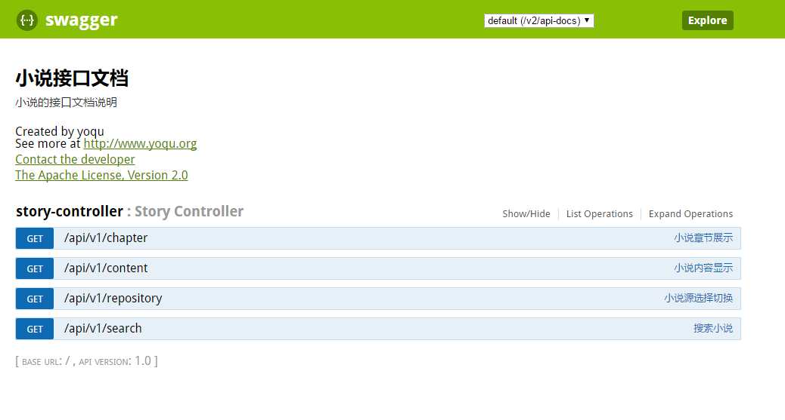
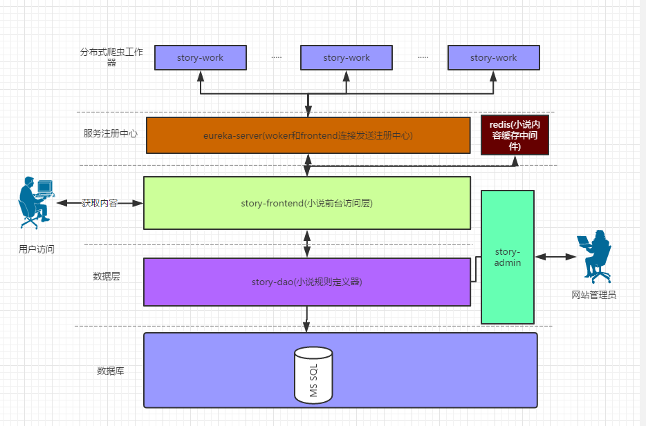
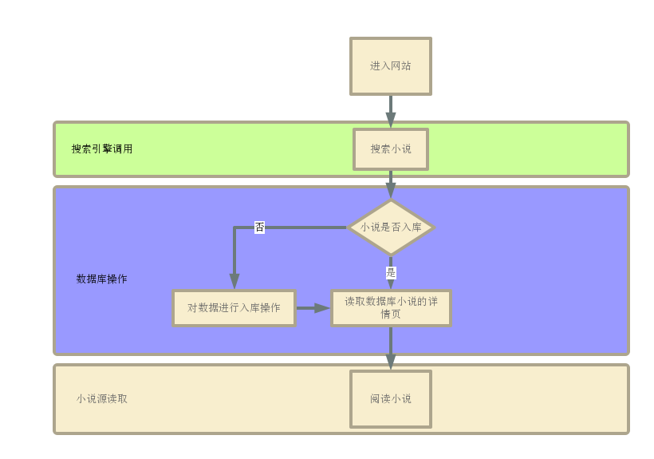

# 分布式小说爬虫说明

`author` : [yoqu](http://www.yoqu.org) 、[Zack](https://github.com/uSERken)

`createTime` : 2017年06月02 下午4:47


---
# 爬虫简介

本项目主要用于学习爬虫知识搭建的项目，目标是做一个分布式多网站小说**智能**爬虫，动态提交爬取任务，单线管理，多ip终端防反扒（使用Eureka server 管理自服务的心跳连接）

目前正在初始开发中。完成后的功能主要有：
* 提供restful接口对外显示整个小说库的数据,需实现安全认证

* 提供一套界面用于管理爬取网站的规则

* 提供一套简易风格界面用于阅读小说


# 开发进度

- [x] 后台规则管理
- [x] eureka-server搭建
- [x] 小说具体爬取功能开发
- [ ] 小说入库存储优化
- [ ] 小说redis缓存功能
- [ ] 小说前端html界面提供
- [ ] 前端restful接口基于oath2授权认证开发

# 启动项目

## 启动步骤
 1. 下载项目到本地目录，使用idea导入本项目，并解决依赖问题
 2. 运行eureka-server 中的`EurekaServerApplication`的`main`方法
 3. 修改`story-admin`和`frontend`中的`application-dev.yml`文件中的数据库连接账号和密码
 4. 启动`story-admin`，项目第一次启动会往数据库中建立初始脚本
 5. 启动`story-worker`.
 6. 启动`story-frontend` 在浏览器输入http://localhost:3333/api/v1/search?name= ***填写搜索的书名***
    例如输入http://localhost:3333/api/v1/search?name=逆鳞
    返回的结果如下：


```json
       {
           "code": 200,
           "data": {
               "stories": [
                   {
                       "newChapter": "第七百一十八章、风再起时！【卓雅居全文字秒更】",
                       "resourceSite": null,
                       "chapters": null,
                       "author": null,
                       "lastUpdateDate": null,
                       "name": "逆鳞",
                       "id": null,
                       "bookUrl": "http://www.sodu.cc/mulu_26997.html",
                       "resourceSiteUrl": null
                   },
                   {
                       "newChapter": "第163章 化敌为友",
                       "resourceSite": null,
                       "chapters": null,
                       "author": null,
                       "lastUpdateDate": null,
                       "name": "逆鳞苍穹传",
                       "id": null,
                       "bookUrl": "http://www.sodu.cc/mulu_458710.html",
                       "resourceSiteUrl": null
                   }
               ]
           },
           "message": null,
           "success": true
       }
```

## 更多API文档
 本地能成功跑起项目后，输入localhost:3333/swagger-ui.html查看API文档，文档使用swagger-ui
 截图展示：



# 项目结构

## 目录结构


```

├── common-utils    公共工具类
├── eureka-server   服务注册发现中心，用于做多个worker集线管理
├── story-admin    后台管理界面，管理抓取规则等功能
├── story-api    公共api
├── story-dao    数据访问层
└── story-frontend  前端访问层，主要用于小说内容访问层
└── story-worker  小说抓取器，有关爬虫相关的操作均由worker去操作

```
## 系统架构




## 业务逻辑图




# 程序交流

交流QQ群：**536747201**

# 使用技术

项目所选用的技术框架以及工具(包括但不限于)：
* Java
* jdk1.8
* Maven
* Spring Boot
* Spring Cloud
* Spring Cloud Eureka
* Mysql
* Redis
* WebMagic
* swagger-ui

